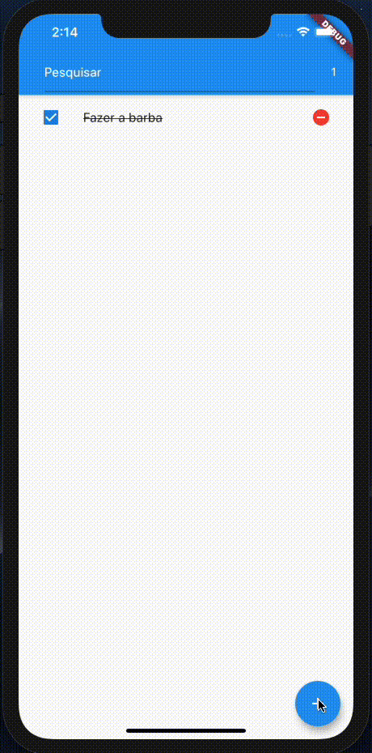

# Aplicativo de TODO

## Objetivo
  - Criar um aplicativo para simular a criação de todos
  - O aplicativo permite:
    - Criar um novo TODO
    - Deletar um TODO
    - Filtrar TODOS
    - Marcar um TODO como concluído
    - Contador de TODOS concluído
  
## Tecnologias utilizadas
  - Flutter
  - MobX
  - MobX Codegen
  - Build Runner

  ## Aplicativo em funcionamento

  
